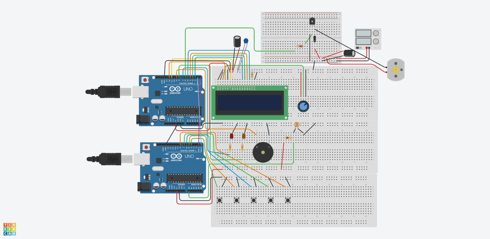

# Jet Engine Control Unit Model 

A project using two Arduino boards to mimic some of the basic functions of an engine control unit. Controlling an LCD, fan/motor, LEDs, and a buzzer. The system reacts to button inputs and input from a temperature sensor.

## The Setup

**Board 1 (Controller Board)**
- Reads the analog voltage via the voltage divider made with a 10k Ohm resistor connected in series to a 10k Ohm NTC thermistor (displayed as a photoresistor in TinkerCAD).
- Converts voltage drop into temperature through Steinhart's two-point beta equation.
- Continuously monitors three fault-inducing button inputs that are programmed to cause a simulated engine fire, oil overtemp, and overspeed condition.
- Implemented button debouncing to filter out mechanical noise and prevent repeated signals for one press.
- Determines when a fault is present and begins a 10-second time-out.
- Sends error messages over Serial communication to board 2.

**Board 2 (Display Board)**
- Runs a listening loop to interpret specific error messages sent from board 1.
- Displays the current RPM and each fault as they occur.
- LEDs and a buzzer provide visual and audio warnings.
- Controls a motor via PWM (Pulse Width Modulation) and safely shutsdown the motor in the event of a fault.
